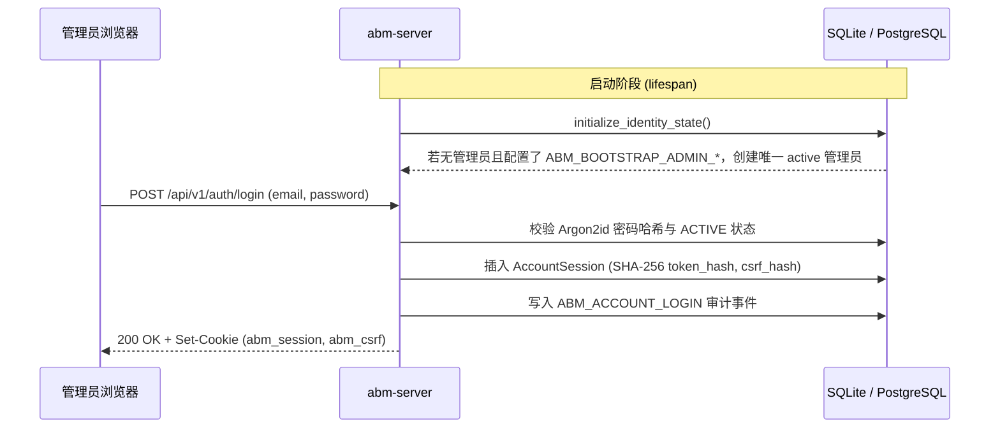
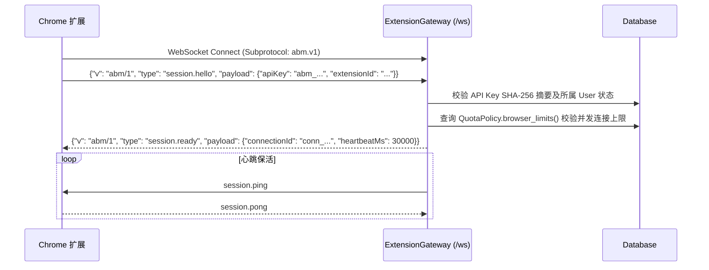
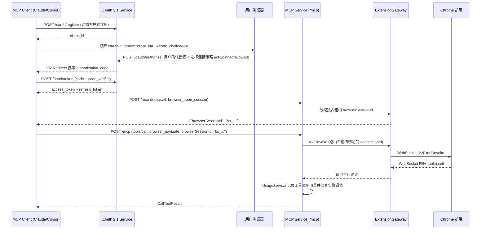
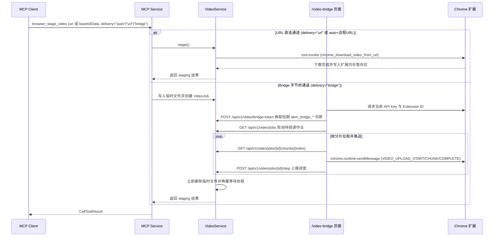

# ABM Server 端到端数据流

## 1. 单用户初始化与 Web 登录

```mermaid
sequenceDiagram
    participant Admin as 管理员浏览器
    participant Server as abm-server
    participant DB as SQLite / PostgreSQL

    Note over Server,DB: 启动阶段 (lifespan)
    Server->>DB: initialize_identity_state()
    DB-->>Server: 若无管理员且配置了 ABM_BOOTSTRAP_ADMIN_*，创建唯一 active 管理员

    Admin->>Server: POST /api/v1/auth/login (email, password)
    Server->>DB: 校验 Argon2id 密码哈希与 ACTIVE 状态
    Server->>DB: 插入 AccountSession (SHA-256 token_hash, csrf_hash)
    Server->>DB: 写入 ABM_ACCOUNT_LOGIN 审计事件
    Server-->>Admin: 200 OK + Set-Cookie (abm_session, abm_csrf)
```

---

## 2. 浏览器扩展 WebSocket 握手与保活

```mermaid
sequenceDiagram
    participant Ext as Chrome 扩展
    participant GW as ExtensionGateway (/ws)
    participant DB as Database

    Ext->>GW: WebSocket Connect (Subprotocol: abm.v1)
    Ext->>GW: {"v": "abm/1", "type": "session.hello", "payload": {"apiKey": "abm_...", "extensionId": "..."}}
    GW->>DB: 校验 API Key SHA-256 摘要及所属 User 状态
    GW->>DB: 查询 QuotaPolicy.browser_limits() 校验并发连接上限
    GW-->>Ext: {"v": "abm/1", "type": "session.ready", "payload": {"connectionId": "conn_...", "heartbeatMs": 30000}}
    loop 心跳保活
        GW->>Ext: session.ping
        Ext-->>GW: session.pong
    end
```

---

## 3. MCP OAuth 2.1 + PKCE 授权与工具调用

```mermaid
sequenceDiagram
    participant Agent as MCP Client (Claude/Cursor)
    participant OAuth as OAuth 2.1 Service
    participant Browser as 用户浏览器
    participant MCP as MCP Service (/mcp)
    participant GW as ExtensionGateway
    participant Ext as Chrome 扩展

    Agent->>OAuth: POST /oauth/register (动态客户端注册)
    OAuth-->>Agent: client_id
    Agent->>Browser: 打开 /oauth/authorize?client_id=...&code_challenge=...
    Browser->>OAuth: POST /oauth/authorize (用户确认授权 + 选择连接策略 auto/pinned/allowlist)
    OAuth-->>Agent: 302 Redirect 携带 authorization_code
    Agent->>OAuth: POST /oauth/token (code + code_verifier)
    OAuth-->>Agent: access_token + refresh_token

    Agent->>MCP: POST /mcp (tools/call: browser_open_session)
    MCP->>GW: 分配独占租约 browserSessionId
    GW-->>Agent: {"browserSessionId": "bs_..."}

    Agent->>MCP: POST /mcp (tools/call: browser_navigate, browserSessionId="bs_...")
    MCP->>GW: tool.invoke (路由至租约绑定的 connectionId)
    GW->>Ext: WebSocket 下发 tool.invoke
    Ext-->>GW: WebSocket 回传 tool.result
    GW-->>MCP: 返回执行结果
    MCP->>MCP: UsageService 记录工具调用用量并检查告警阈值
    MCP-->>Agent: CallToolResult
```

---

## 4. 视频双通道投递链路

```mermaid
sequenceDiagram
    participant Agent as MCP Client
    participant MCP as MCP Service
    participant Video as VideoService
    participant Bridge as /video-bridge 页面
    participant Ext as Chrome 扩展

    Agent->>MCP: browser_stage_video (url 或 base64Data, delivery="auto"|"url"|"bridge")
    alt URL 直连通道 (delivery="url" 或 auto+远程URL)
        MCP->>Video: stage()
        Video->>Ext: tool.invoke (chrome_download_video_from_url)
        Ext-->>Video: 下载完成并写入扩展内存暂存区
        Video-->>MCP: 返回 staging 结果
    else Bridge 字节桥通道 (delivery="bridge")
        MCP->>Video: 写入临时文件并创建 VideoJob
        Bridge->>Ext: 请求当前 API Key 与 Extension ID
        Bridge->>Video: POST /api/v1/video/bridge-token 换取短期 abm_bridge_* 令牌
        Bridge->>Video: GET /api/v1/video/jobs 轮询待投递作业
        loop 按分片拉取并推送
            Bridge->>Video: GET /api/v1/video/jobs/{id}/chunks/{index}
            Bridge->>Ext: chrome.runtime.sendMessage (VIDEO_UPLOAD_START/CHUNK/COMPLETE)
            Bridge->>Video: POST /api/v1/video/jobs/{id}/step 上报进度
        end
        Video->>Video: 立即删除临时文件并唤醒等待协程
        Video-->>MCP: 返回 staging 结果
    end
    MCP-->>Agent: CallToolResult
```
